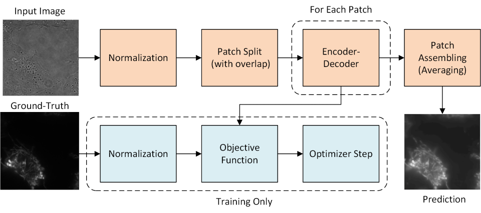

# LightMyCells 2024
Contribution to the LightMyCells Challenge (IEEE ISBI 2024) by Marek Wodzinski (3rd place).

Here you can see the source code used to train / test the proposed solution (only the final experiments, without the ablations).

Only the final experiment is left (the one used for the final Docker submission).

The network was trained using HPC infrastructure (PLGRID). Therefore the .slurm scripts are omitted for clarity.

Please cite:
* The LightMyCells challenge paper (TODO) 
* The method description paper (TODO)

if you found the source code useful.
